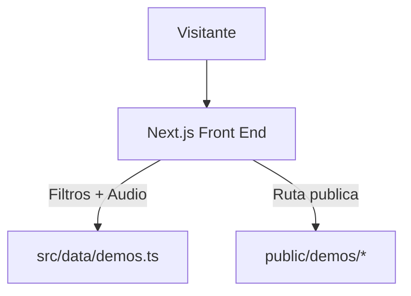

# Arquitectura Vocalis AI

## Objetivo

Sitio B2B para mostrar demos de agentes conversacionales de voz por sector. El flujo operativo sera manual: subir audios a carpetas publicas y registrar la ruta en el arreglo de datos.

## Stack recomendado

- Next.js con App Router.
- React para interaccion.
- TypeScript estricto.
- Archivos estaticos en `public/demos/`.

## Mapa funcional

- Publico: hero, filtros, galeria de demos, formulario de contacto.
- Edicion: actualizacion manual de `src/data/demos.ts`.
- Datos: sectores, demos y rutas de audio.

## Estructura de datos

### `demos`

Campos:

- `title`
- `description`
- `sectorId`
- `sectorLabel`
- `audioUrl`
- `durationLabel`
- `accent`

### `sectors`

Campos:

- `id`
- `label`

## Diagrama

## Decisiones clave

### 1. Front end estatico y simple

Menos complejidad operativa. No hay dependencia de backend para publicar demos.

### 2. Carpetas por sector

Cada audio vive en una carpeta clara por industria. Facil de mantener y de explicar al equipo.

### 3. Datos en archivo

`src/data/demos.ts` funciona como catalogo editable. Cambias nombre o URL y listo.

### 4. Audio como tarjeta principal

El reproductor debe vender la demo. La UI se ordena alrededor de eso.

## Riesgos

- Un archivo mal nombrado rompe la reproduccion.
- La lista de datos puede desincronizarse del contenido real si no se actualiza.

## Mitigacion

- Usar nombres estandarizados por sector.
- Mantener el mismo nombre entre archivo y `audioUrl`.
- Revisar el catalogo antes de publicar.
